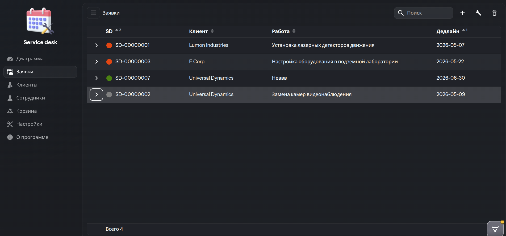
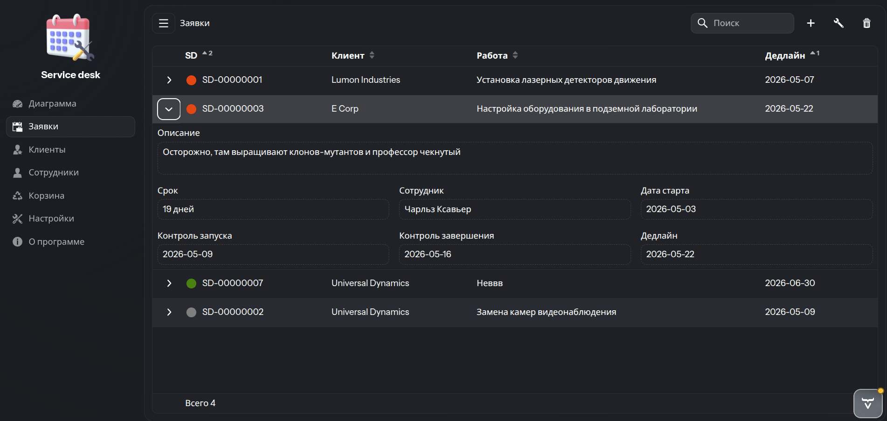
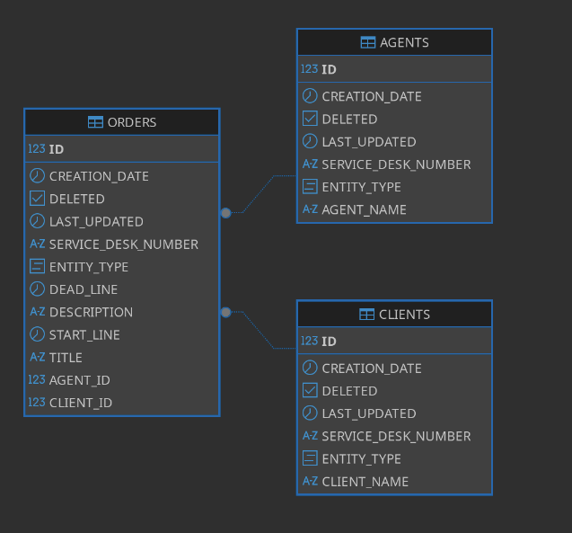

## Service Desk

Это приложение для работы с базой данных небольшой компании, занимающейся обслуживанием заявок клиентов.

### Основные функции
- [x] Учет сотрудников
- [x] Учет клиентов
- [x] Учет заявок от клиентов и какой сотрудник ведет заявку
- [x] Корзина для удаленных элементов с возможностью восстановления
- [ ] Дашборд со статистикой заявок
- [ ] Функция отправки оповещений по электронной почте при создании новой заявки

### Требования (Environmental Requirements)
Для запуска проекта требуется: - Java версии 21  
Приложение работает на порту указанном в файле application.yaml  
Для работы с приложением используйте любой браузер или веб-клиент

### Запуск приложения на сервере (Running the Application)
Откройте терминал в корне проекта и выполните команды для запуска приложения.

**Вариант 1 Spring**  
`mvn spring-boot:run`
- для остановки CTRL+C

**Вариант 2 Java**  
`mvn clean`  
`mvn package`     
`cd target`  
`java -jar *.jar`  
- для остановки CTRL+C

**Вариант 3 Docker**   
`mvn package`  
`sudo docker build -t service-desk-image .`  
`sudo docker run --name service-desk -p 8080:8080 service-desk-image`  
- для остановки `sudo docker stop service-desk`  

### Схема базы данных (Database map)

#### Архитектурный стиль (Architectural Style)
- Монолитная архитектура (monolithic)  
- Слоистая структура (layered architecture)
- Серверная генерация UI (server-side rendering)
- Типобезопасный UI (strongly typed UI)
