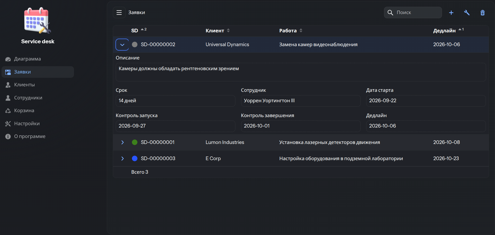
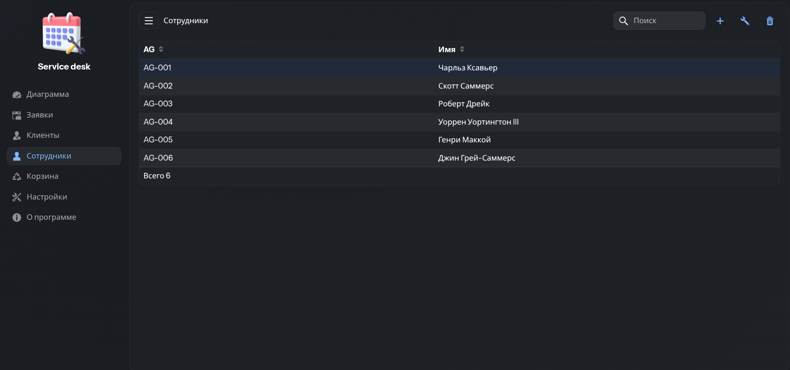
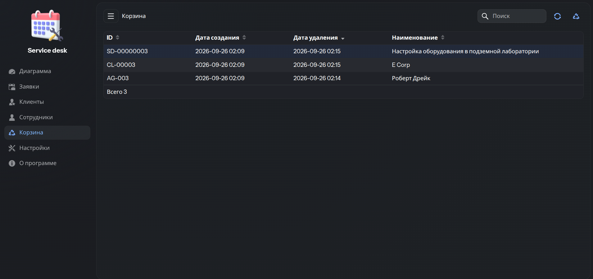
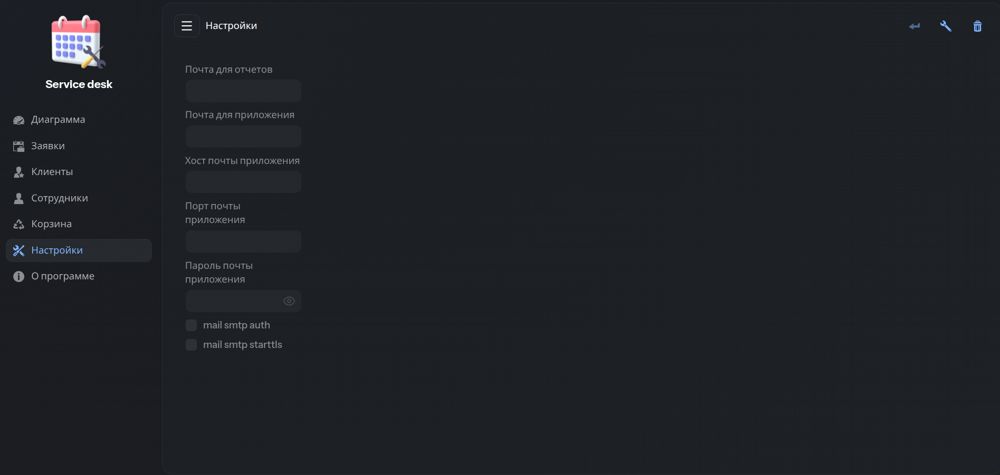
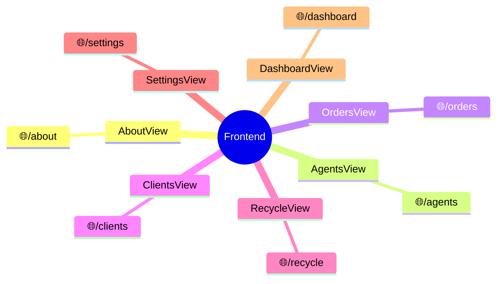
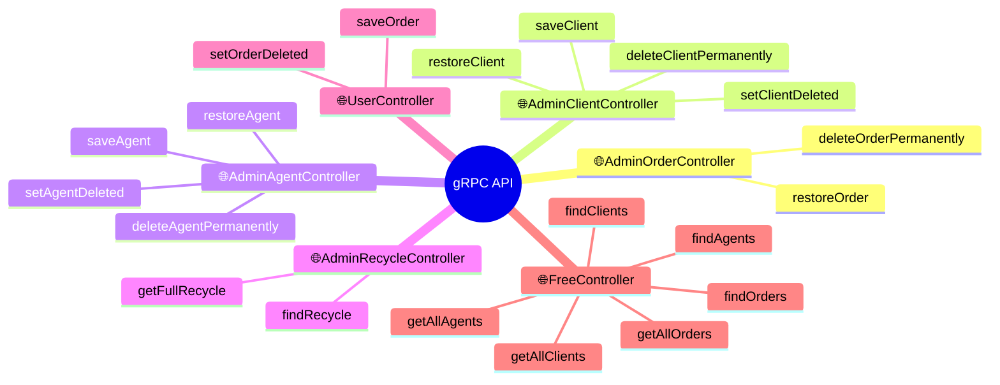
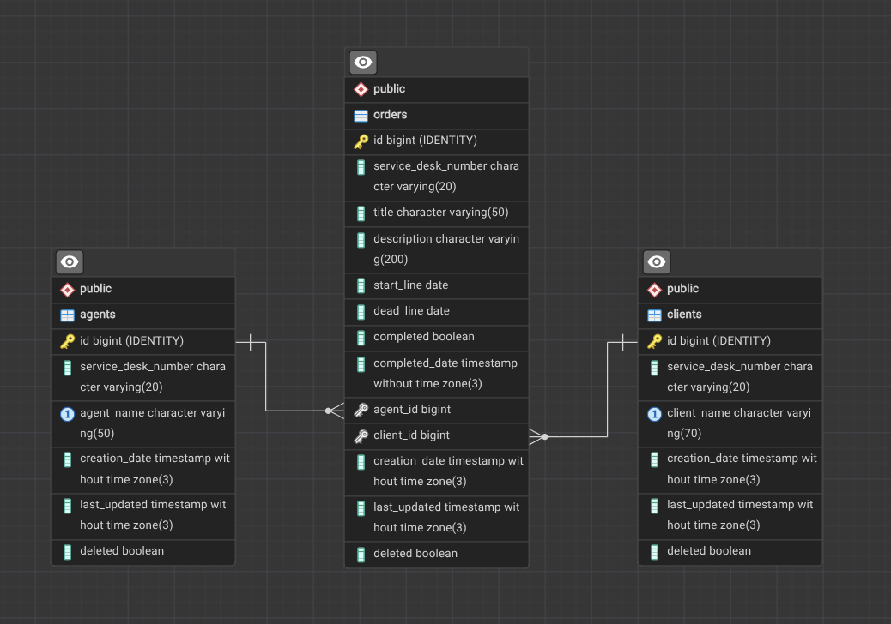

## Service Desk


Это приложение для работы с базой данных небольшой компании, занимающейся обслуживанием заявок клиентов.








### Основные функции
- [x] Учет сотрудников
- [x] Учет клиентов
- [x] Учет заявок от клиентов и какой сотрудник ведет заявку
- [x] Корзина для удаленных элементов с возможностью восстановления
- [ ] Дашборд со статистикой заявок
- [ ] Функция отправки оповещений по электронной почте при создании новой заявки

### Модули (Modules)
- Backend (Hibernate, Postgres)
- Frontend (Vaadin UI)

Взаимодействие модулей между собой осуществляется по gRPC (HTTP-2)

### Требования для запуска (Environmental Requirements)
Перед началом убедитесь, что установлено:

| Инструмент     | Версия                            | Проверка               |
|----------------|-----------------------------------|------------------------|
| Docker Desktop | 4.x+                              | docker --version       |
| Docker Compose | v2+                               | docker compose version |
| JDK            | 25                                | java -version          |
| Maven          | 3.9+                              | mvn -version           |
| Node.js        | 20+ (для локальной сборки Vaadin) | node -v                |
| Git            | любая                             | git --version          |

### Запуск приложения на локальной машине (Running the Application)

Откройте терминал и выполните команды для запуска приложения.

**1. Склонировать проект**

```bash
git clone <URL_репозитория>
```

**2. Перейти в корень проекта**

```bash
cd <имя_проекта>
```

**3. Запуск**

Первый запуск будет долгим 5-15 мин.  
Необходим интернет для скачивания сторонних библиотек и образов.  

```bash
docker compose up --build -d
```

**4. Использование**

Откройте браузер на странице http://localhost:8080

**5. Остановка**

Без сохранения данных

```bash
docker compose down -v
```

С сохранением данных

```bash
docker compose down
```

**6. Полное удаление**

```bash
docker compose down -v --rmi all
```

### REST эндпоинты фронтенда


### gRPC эндпоинты бэкенда (Backend gRPC endpoints)


### Схема базы данных (Database map)

